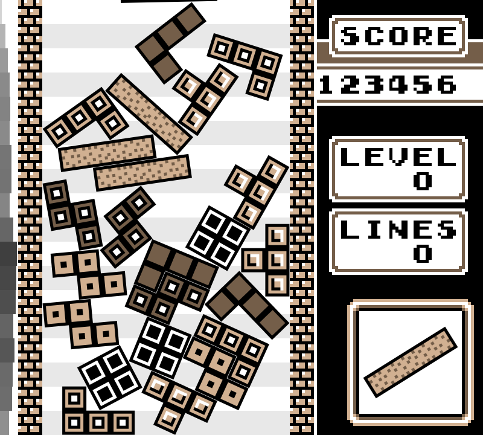

# Not Tetris 2, revived

**[Play it in your browser →](https://jrr.github.io/nottetris2-revived/)**



[Not Tetris 2](https://stabyourself.net/nottetris2/) is Tetris where the pieces
are physical objects. They don't snap to a grid: they fall, tip over, slide and
pile up however they land. A row clears once it's filled enough, slicing
through whatever pieces are in it.

It was made by Maurice Guégan ([Stabyourself.net](https://stabyourself.net))
in 2011, for version 0.7.2 of the [LÖVE](https://love2d.org) game engine, which
current versions of LÖVE can't run. This project ports it forward, one engine
version at a time, to LÖVE 11.5, and from there to the web.

## Controls

| | Keys |
|---|---|
| Move | ← → |
| Drop faster | ↓ |
| Rotate | Z (counterclockwise), X (clockwise) |
| Pause | Enter |
| Back to the menu | Esc |

Two players (2PLY on the title screen) share a keyboard: player 1 uses A D S
to move and G H to rotate, and player 2 uses the arrow keys and numpad 1 and 2.

In the browser, click the page to turn on sound. It runs a little slower than
the desktop version, and high scores are saved in your browser.

## Playing on your computer

Install [LÖVE 11.5](https://love2d.org), then:

```
git clone --recursive https://github.com/jrr/nottetris2-revived
love nottetris2-revived/game
```

## How it's organized

- [jrr/nottetris2](https://github.com/jrr/nottetris2) is the game: a fork of
  the original release, changed only as much as each engine version needs.
  It's the `game/` submodule here.
- This repo is everything around it: the web version, and the test harness
  that checked every step of the port.

Each finished port is tagged, so every stage, the original 2011 release
included, can still be played on the engine it was made for: see
[Milestones](#milestones).

## Credits

Not Tetris 2 is by Maurice Guégan, released under the
[WTFPL](game/LICENSE.txt). The web version uses
[2dengine's love.js](https://github.com/2dengine/love.js), which builds on
ports of LÖVE to the web by David Khachaturov and Tanner Rogalsky.

## Porting harness

The rest of this page is for working on the port.

The harness plays the game headless from scripted scenarios on any LÖVE
version, saving screenshots and game state. It's for porting the game to
newer engine versions one step at a time, with something that checks every
step. The game itself is not modified: the harness is added to a copy of it
at run time.

### Running the scenarios

Needs Docker. Each LÖVE version's image builds from source on first use, which takes a few minutes.

```
git clone --recursive https://github.com/jrr/nottetris2-revived && cd nottetris2-revived
./run.sh                      # every scenario, compared to the baselines
./run.sh gameA                # one scenario
./run.sh --game ../nottetris2 # another checkout of the game
./run.sh --update             # accept the current output as the baseline
./run.sh --ref release-2011-06-20   # the game as it was at a tag, branch or commit
```

Each scenario's output goes to `out/<love>/<scenario>/`: `log.txt`, and
`files/` with PNG screenshots, `state.txt` dumps and the game's own save files.
A scenario fails if the game errors, times out, or an `expect` step fails.
Otherwise it passes when the output's checksums match `expected/<scenario>/`.

Both `run.sh` and `play.sh` run the game on the LÖVE version its `conf.lua`
asks for (0.7.2 if it doesn't say), unless `--love` says otherwise.

`--ref` (for `run.sh` and `play.sh`) takes the game from a tag, branch or
commit of the game repo instead; a branch can be one that's only on GitHub.
The baselines only describe the current game, so these runs check behavior
only: nothing errors, every `expect` passes. Each finished port is tagged,
so earlier versions stay playable: see [Milestones](#milestones).

### Playing by hand

```
./play.sh                     # VNC, same LÖVE version and game as run.sh
./play.sh --web               # in the browser, with sound
./play.sh --mac               # in LÖVE's own macOS build (after `mise install`)
./play.sh --ref release-2011-06-20   # an earlier version of the game
./play.sh --stop
```

The game runs in the same Linux container as the scenarios, so this works
for versions with no macOS build that runs on Apple Silicon, 0.7.2 included.
Both listen on localhost only.

- **VNC** (default): a VNC server shares the game's screen and macOS Screen
  Sharing opens on it (password `love`). Light, but no sound.
- **`--web`**: [Selkies](https://github.com/selkies-project/selkies) streams
  the game with sound to a browser tab at http://localhost:8080. It runs the
  display and sound server in its own container, which the game's container
  connects to, so the version images need nothing for it. The game starts
  once the tab has connected. Downloads a 2.4 GB image the first time.
- **`--mac`**: runs the game in LÖVE's own macOS build of the right version,
  with a native window and sound. [mise](https://mise.jdx.dev) installs those
  builds from LÖVE's GitHub releases (`mise install`, once; the versions are
  in `mise.toml`). Before 11.4 they're Intel-only and run under Rosetta.
  Unreleased versions aren't GitHub releases, so mise can't install them:
  `lib/fetch-ci-build.sh 12.0 <commit>` downloads LÖVE's CI build of that
  commit into `builds/` instead (needs `gh`; GitHub deletes CI builds after
  90 days).
  0.7.2's build is 32-bit and can't run on current macOS, so the original
  release needs one of the container modes above.

#### Milestones

Each finished port is tagged in both repos. `--ref` plays the game at a tag
on the LÖVE version it was made for, and the current harness runs them all
(`./run.sh --ref <tag>` checks one).

| Tag | LÖVE | Play | |
|---|---|---|---|
| `release-2011-06-20` | 0.7.2 | `./play.sh --web --ref release-2011-06-20` | The original release (game repo only). No `--mac`. |
| `love-0.8.0` | 0.8.0 | `./play.sh --mac --ref love-0.8.0` | Box2D 2.2. |
| `love-0.9.2` | 0.9.2 | `./play.sh --mac --ref love-0.9.2` | Box2D 2.3, SDL2. |
| `love-0.10.2` | 0.10.2 | `./play.sh --mac --ref love-0.10.2` | Image fonts need `extraspacing`; borderless fullscreen. |
| `love-11.3` | 11.3 | `./play.sh --mac --ref love-11.3` | Colors 0–1; 0.10's physics iterations kept. |
| `love-11.4` | 11.4 | `./play.sh --mac --ref love-11.4` | First native macOS arm64 build; harness on LuaJIT 2.1. |
| `love-11.5` | 11.5 | `./play.sh --mac --ref love-11.5` | Current stable. |

### Layout

| Path | |
|---|---|
| `game/` | submodule: jrr/nottetris2, `main` branch |
| `docker/love-<version>.Dockerfile` | LÖVE built for Xvfb and software rendering |
| `docker/entry.sh` | runs in the container: play the game, collect its save files |
| `docker/play.*` | VNC layer on top of any version's image, for `play.sh` (`--web` needs none) |
| `mise.toml` | LÖVE's macOS builds, for `play.sh --mac`; `mise run love-file` builds `out/nottetris.love`; `mise run web` plays it in a browser |
| `lua/harness_main.lua` | fixed clock, seed and keyboard; plays the scenario steps |
| `lua/harness_compat.lua` | everything that differs between LÖVE versions |
| `scenarios/*.lua` | the scenarios; step format at the top of `harness_main.lua` |
| `expected/` | baselines, and `love-version`, the version they were made with |
| `lib/ref.sh` | `--ref`: export the game at a ref; the LÖVE version a game wants |
| `lib/build-web.sh` | the game in a browser (2dengine's love.js), for `mise run web` and Pages |
| `.github/workflows/pages.yml` | publishes that to GitHub Pages on every push to main |
| `lib/fetch-ci-build.sh` | an unreleased LÖVE's macOS build from CI, for `play.sh --mac` |
| `probe/` | reports which APIs a LÖVE version has |

### Reviewing a port

Physics changes between engine versions (Box2D 2.0 in LÖVE 0.7.2, 2.2 in 0.8,
2.3 from 0.9), so screenshots won't match across versions, and they don't need
to. Between versions, the `expect` steps are the automated check. The
screenshots are for a person to judge.

Baselines keep the same paths across versions, so moving them to a new
version shows every screenshot as a before/after image diff on GitHub:

1. A game PR on jrr/nottetris2, e.g. `port-0.8` into `main`.
2. A harness PR from a branch with the same name. It points `game/` at the
   game branch, adds what the new version needs (below) and runs
   `./run.sh --love 0.8.0 --update`.
3. The game PR links to the harness PR. Its "Files changed" tab shows the
   screenshots before and after.

Merge both once the pictures look right, then point `game/` back at `main`.

### Adding a LÖVE version

1. `docker/love-<version>.Dockerfile`, starting from the 0.7.2 one.
2. Run the probe against it (command at the top of `probe/main.lua`) and
   record what it finds there.
3. Teach `harness_compat.lua` the version's differences. It refuses to run on
   versions it hasn't been checked against.
4. Run the scenarios. Expect failures until the game is ported too.
5. Once both PRs are merged, tag `love-<version>` in both repos and add it
   to [Milestones](#milestones).
